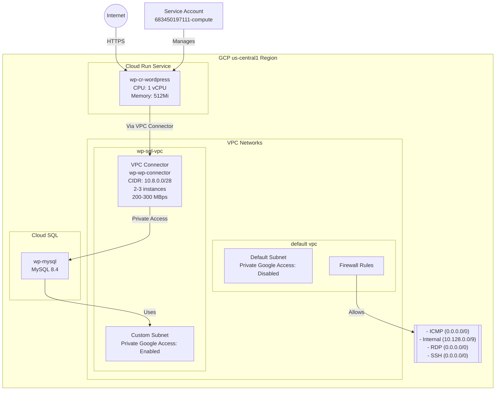

# GCP Infrastructure Documentation
Generated on: 2024-01-24

## Overview
This document provides a comprehensive overview of the Google Cloud Platform (GCP) infrastructure currently in use.

## Table of Contents
- [Quick Access Links](#quick-access-links)
- [Project Information](#project-information)
  - [Available Projects](#available-projects)
- [Infrastructure Components](#infrastructure-components)
  - [Compute Resources](#compute-resources)
    - [Compute Engine](#compute-engine)
    - [Cloud Functions](#cloud-functions)
    - [Cloud Run Services](#cloud-run-services)
  - [Storage Resources](#storage-resources)
    - [Cloud Storage](#cloud-storage)
    - [Cloud SQL](#cloud-sql)
  - [Network Configuration](#network-configuration)
    - [VPC Networks](#vpc-networks)
    - [Firewall Rules](#firewall-rules)
  - [Architecture Summary](#architecture-summary)
  - [Network Topology](#network-topology)
  - [Identity and Access Management (IAM)](#identity-and-access-management-iam)
    - [Service Accounts](#service-accounts)

## Quick Access Links
- [GCP Console Home](https://console.cloud.google.com/home/dashboard?project=wp-serverless-demo)
- [Cloud Run Services](https://console.cloud.google.com/run?project=wp-serverless-demo)
- [Cloud SQL Instances](https://console.cloud.google.com/sql/instances?project=wp-serverless-demo)
- [VPC Networks](https://console.cloud.google.com/networking/networks/list?project=wp-serverless-demo)
- [Firewall Rules](https://console.cloud.google.com/networking/firewalls/list?project=wp-serverless-demo)
- [IAM & Admin](https://console.cloud.google.com/iam-admin/iam?project=wp-serverless-demo)
- [Service Accounts](https://console.cloud.google.com/iam-admin/serviceaccounts?project=wp-serverless-demo)

## Project Information
Current project: wp-serverless-demo

### Available Projects
| Project ID | Name | Project Number | State | Console Link |
|------------|------|----------------|-------|--------------|
| matts-ga-sandbox | Matt's GA Sandbox | 929276460361 | ACTIVE | [View Project](https://console.cloud.google.com/home/dashboard?project=matts-ga-sandbox) |
| matts-search-eng-1612273907005 | Matt's Search Engine | 457093336574 | ACTIVE | [View Project](https://console.cloud.google.com/home/dashboard?project=matts-search-eng-1612273907005) |
| my-project-1526479890245 | My Project | 829656162028 | ACTIVE | [View Project](https://console.cloud.google.com/home/dashboard?project=my-project-1526479890245) |
| shopify-pm-demo-1554146966007 | Shopify PM Demo | 587014820973 | ACTIVE | [View Project](https://console.cloud.google.com/home/dashboard?project=shopify-pm-demo-1554146966007) |
| wp-serverless-demo | wp-serverless-demo | 683450197111 | ACTIVE | [View Project](https://console.cloud.google.com/home/dashboard?project=wp-serverless-demo) |

## Infrastructure Components
The following sections detail the various GCP resources and their configurations.

### Compute Resources

#### Compute Engine
No Compute Engine instances found in the current project.

#### Cloud Functions
Cloud Functions API is not enabled for this project.

#### Cloud Run Services
| Service Name | Region | Last Modified By | Last Deployed | Console Link |
|--------------|--------|------------------|---------------|--------------|
| wp-cr-wordpress | us-central1 | matthewjweber@gmail.com | 2024-10-24T06:42:53.140609Z | [View Service](https://console.cloud.google.com/run/detail/us-central1/wp-cr-wordpress?project=wp-serverless-demo) |

##### WordPress Service Details (wp-cr-wordpress)

###### Service Configuration
- **Image**: mirror.gcr.io/library/wordpress
- **Service Account**: 683450197111-compute@developer.gserviceaccount.com
- **Creation Time**: 2024-10-24T06:42:34.631459Z
- **URLs**: 
  - https://wp-cr-wordpress-683450197111.us-central1.run.app
  - https://wp-cr-wordpress-gtwkniiqna-uc.a.run.app

###### Resource Allocation
- **CPU Limit**: 1000m (1 vCPU)
- **Memory Limit**: 512Mi
- **Container Concurrency**: 80
- **Timeout**: 300 seconds

###### Autoscaling Configuration
- **Minimum Instances**: 1
- **Maximum Instances**: 2

###### Network Configuration
- **Ingress**: All traffic allowed
- **VPC Access**: 
  - Connector: wp-wp-connector
    - Machine Type: e2-micro
    - IP CIDR Range: 10.8.0.0/28
    - Min Instances: 2
    - Max Instances: 3
    - Min Throughput: 200 MBps
    - Max Throughput: 300 MBps
    - Network: wp-sql-vpc
    - State: READY
  - Egress: All traffic
- **Cloud SQL Connection**: wp-serverless-demo:us-central1:wp-mysql

###### Environment Configuration
- **Database Settings**:
  - Host: 10.60.0.3
  - Database: wp-mysql
  - User: admin
  - Password: [Configured]

###### Health Checks
- **Startup Probe**:
  - Type: TCP Socket (Port 80)
  - Period: 240 seconds
  - Timeout: 240 seconds
  - Failure Threshold: 1

###### Traffic Configuration
- **Latest Revision**: wp-cr-wordpress-00001-wng
- **Traffic Split**: 100% to latest revision
- **Status**: Ready (All conditions met)

###### Deployment History
| Revision | Active | Traffic | Creation Time |
|----------|--------|---------|---------------|
| wp-cr-wordpress-00001-wng | Yes | 100% | 2024-10-24T06:42:34.740949Z |

###### Service Status
- **Ready Status**: True (Last transition: 2024-10-24T06:42:53.140609Z)
- **Configuration Status**: Ready (Last transition: 2024-10-24T06:42:51.890286Z)
- **Routes Status**: Ready (Last transition: 2024-10-24T06:42:53.106950Z)
- **Generation**: 1
- **Observed Generation**: 1

### Storage Resources

#### Cloud Storage
No Cloud Storage buckets found in the current project.
[View Cloud Storage Browser](https://console.cloud.google.com/storage/browser?project=wp-serverless-demo)

#### Cloud SQL
| Instance Name | Database Version | Status | Console Link |
|--------------|------------------|---------|--------------|
| wp-mysql | MySQL 8.4 | RUNNABLE | [View Instance](https://console.cloud.google.com/sql/instances/wp-mysql/overview?project=wp-serverless-demo) |

### Network Configuration

#### VPC Networks
1. default ([View in Console](https://console.cloud.google.com/networking/networks/details/default?project=wp-serverless-demo))
   - Default VPC network with auto-created subnets in multiple regions
   - Private Google Access: Disabled
2. wp-sql-vpc ([View in Console](https://console.cloud.google.com/networking/networks/details/wp-sql-vpc?project=wp-serverless-demo))
   - Custom VPC network
   - Contains subnet 'subnet' in us-central1 with Private Google Access enabled

#### Firewall Rules
| Rule Name | Network | Direction | Priority | Source Ranges | Allow | Console Link |
|-----------|---------|-----------|-----------|---------------|-------|--------------|
| default-allow-icmp | default | INGRESS | 65534 | 0.0.0.0/0 | icmp | [View Rule](https://console.cloud.google.com/networking/firewalls/details/default-allow-icmp?project=wp-serverless-demo) |
| default-allow-internal | default | INGRESS | 65534 | 10.128.0.0/9 | tcp:0-65535, udp:0-65535, icmp | [View Rule](https://console.cloud.google.com/networking/firewalls/details/default-allow-internal?project=wp-serverless-demo) |
| default-allow-rdp | default | INGRESS | 65534 | 0.0.0.0/0 | tcp:3389 | [View Rule](https://console.cloud.google.com/networking/firewalls/details/default-allow-rdp?project=wp-serverless-demo) |
| default-allow-ssh | default | INGRESS | 65534 | 0.0.0.0/0 | tcp:22 | [View Rule](https://console.cloud.google.com/networking/firewalls/details/default-allow-ssh?project=wp-serverless-demo) |

### Architecture Summary
The infrastructure appears to be a WordPress deployment using Cloud Run and Cloud SQL:
1. WordPress application running on Cloud Run (wp-cr-wordpress) in us-central1
2. MySQL database (wp-mysql) running on Cloud SQL
3. Custom VPC network (wp-sql-vpc) likely used for secure database connectivity
4. Default networking rules allowing standard access patterns (SSH, RDP, ICMP, internal communication)

### Network Topology

### Identity and Access Management (IAM)

#### Service Accounts
| Email | Display Name | Status | Console Link |
|-------|--------------|---------|--------------|
| 683450197111-compute@developer.gserviceaccount.com | Compute Engine default service account | Active | [View Service Account](https://console.cloud.google.com/iam-admin/serviceaccounts/details/683450197111-compute@developer.gserviceaccount.com?project=wp-serverless-demo) |

The infrastructure uses the default Compute Engine service account, which typically has the following characteristics:
- Automatically created for Compute Engine resources
- Used by default for Cloud Run services unless otherwise specified
- Has the default Compute Engine service account role
